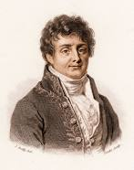
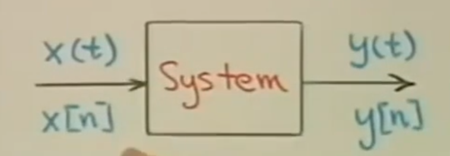
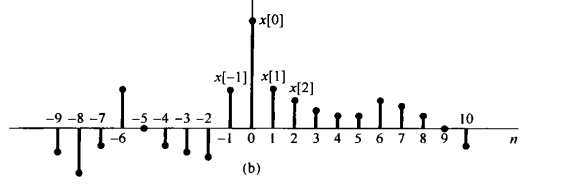

# Signal & System

## Chap 0

 Courseware : [SIGNAL AND SYSTEM Alan V. Oppenheim , MIT OCW](https://ocw.mit.edu/courses/res-6-007-signals-and-systems-spring-2011/resources/lecture-1-introduction/)     
Textbook : [Signal and System by Alan V. Oppenheim](../TextBooks/%E4%BF%A1%E5%8F%B7%E4%B8%8E%E7%B3%BB%E7%BB%9F%20%20%20%E7%AC%AC%E4%BA%8C%E7%89%88%20(%E8%89%BE%E4%BC%A6V.%E5%A5%A5%E6%9C%AC%E6%B5%B7%E5%A7%86)%20.pdf)  

  
J.B Fourier

## Chap 1 : INTRODUCTION

### 1.1 What's signal? 

&emsp;&emsp;&emsp;Signal's unformal definition(or mathematically):     
<b>
 Functions of one or more independent variables that typically carry some information
</b>
Like voice and image , can be regarded as signal.

### 1.2 What's system?
<b>
 System typcally used to process signals
</b>

 

A system may  a continous system or a discrete time system ( $x(t)$ or $x[n]$ )     
system can be basically devided into linear and non-linear or time-invariant and time-varying.  
In this course we focus on LTI(lin.. Time.. in..) and Time & Frequnency domain

### 1.3 Interconnections of system:

Series  
Parallel    
Feedback  (Important in control)
  

## Chap 2 Signals 

### Chap 2.1 sinusoidal signal

CONTINOUS-TIME SINUSOIDAL SIGNAL    
$x(t) = A cos(\omega_{0} t + \phi)$
     

 DISCRETE SINUSOIDAL SIGNAL
    
 

Remeber :

Time shift = Phase change
   

And someting you should pay attention to : The period of discrete signal    
EG:

$f[n] = sin(4n\pi/31)$
The period isn't be $\frac{31\pi}{4}$ cause $n$ must be an integer. so the period is 31    
Another case is that the  $\frac{2\pi}{\omega_{0}}*n$ can't be a integer. The sigal is inperiodic 

### Chap 2.2 expontial signal

 REAL EXPOTENTIAL CONTINOUS-TIME SIGNAL

$x(t) = Ce^{at}$

 REAL  EXPOTENTIAL DIACRETE-TIME SIGNAL

$x(n) = C\alpha^{n} = Ce^{\beta n}$

Remeber :

Time shift = Scale change
 

 CONTINOUS TIME COMPLEX EXPOTENTIAL

$x(t) = Ce^{at}$

but parameter $C$ and $a$ is complex number     
C = $|C|e^{j\theta}$    (Polar form)    
a = $r + j\omega_{0}$   (Rectancular form)  
$x(t) = $

