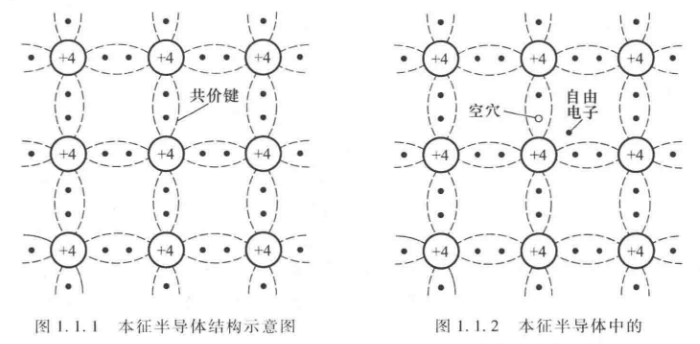
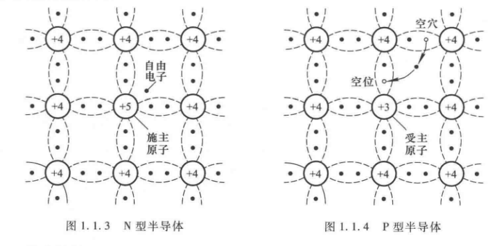

# 模拟电子技术
# Chap 0    
## 课程 [模拟电子技术(清华大学)](https://www.bilibili.com/video/BV1Vp411f71S)
## 课本 [模拟电子技术(上)](../TextBooks/%E6%A8%A1%E6%8B%9F%E7%94%B5%E5%AD%90%E6%8A%80%E6%9C%AF%E5%9F%BA%E7%A1%80%E4%B8%8A%EF%BC%89.pdf)&emsp;[模拟电子技术基础(下)](../TextBooks/%E6%A8%A1%E6%8B%9F%E7%94%B5%E5%AD%90%E6%8A%80%E6%9C%AF%E5%9F%BA%E7%A1%80(%E4%B8%8B).pdf)
#　Chap 1什么是半导体
## Chap 1.1.1 本征半导体
&emsp;导体和绝缘体之间的元素就叫半导体, 材料的导电性能主要由自由电子决定.
绝缘体一般是高价元素,或者高分子物质。
本征半导体是纯净的，晶体结构的半导体    

本征半导体的结构

&emsp;自由电子碰到空穴,二者就会同时消失,这称为复合,有一个自由电子就有一个空穴.
当价电子离开空穴和数量和自由电子复合的数量相等,我们将其成为动态平衡。
本征半导体中的两种载流子则为空穴和自由电子
半导体的导电性能和温度是有关的
## Chap1.1.2杂质半导体
### N(Neigative)型半导体|P(Positive)形半导体    
&emsp;我们在本征半导体中掺入P元素,那么自由电子的数量比空穴就多,这和P的含量有关,这就使得半导体的导电性能可控   
那么掺入B元素的时候,则恰好相反.      
&emsp;注意空位和空穴的区别:空位是不带电的,而空穴是带正电的

杂质半导体的结构

### 多子和少子  
&emsp;多子指的是多数载流子,少子亦然
而且多子在温度下的浓度变化小于少子(使用比例)    
## Chap1.1.3 PN结的形成
### 什么是PN结  
[PN结的wiki](https://zh.wikipedia.org/wiki/Pn%E7%BB%93)     
[Khan acadamy的视频](https://www.bilibili.com/video/BV13t411S7AB)   
  
 PN结的结构  
&emsp;这里的PN结不是将一个P形半导体和一个N形半导体贴在一起,PN结是一块完整的晶体,通过渗透工艺将其做成PN结. 
中间的部分将会相互补充,湮灭。   
&emsp;同时中间产生的电场会阻止这个效应继续进行,这样就形成了一个PN结,中间的部分我们一般叫耗尽层
### PN结的单向导电性能

